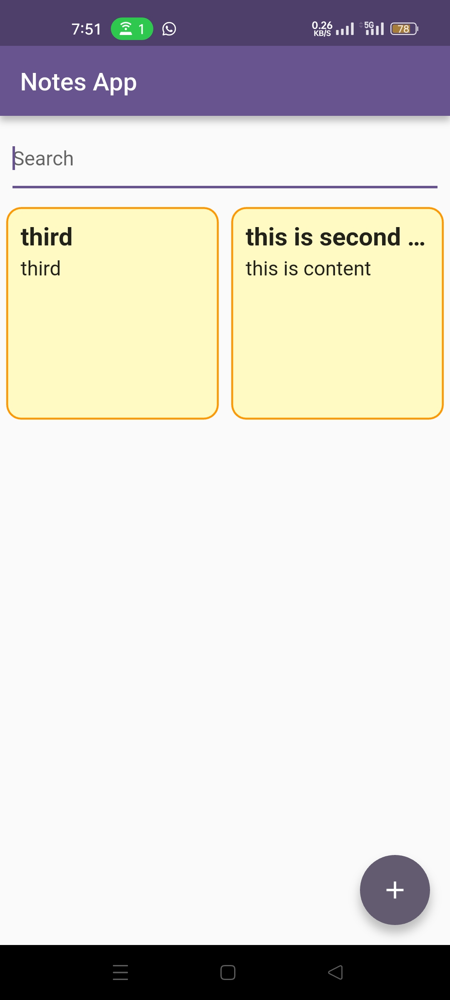

# NotesApp

NotesApp is a feature-rich note-taking application built using Flutter. It offers an appealing user interface and various screens to manage your notes efficiently. The app is designed with a clean architecture and maintains state using the Provider package. It fetches data from a Node.js server hosted on Render, which is designed using Express.

## Features

- Appealing UI
- Multiple screens for managing notes
- Search functionality
- Fetches notes from a Render-hosted server
- Maintains state using Provider
- Clean Flutter architecture

## Tech Stack

- **Frontend:** Flutter
- **State Management:** Provider
- **Backend:** Node.js with Express
- **Hosting:** Render

## Workflow

1. **Home Screen:** Displays a list of notes with a search bar.
2. **Add Note Screen:** Allows users to add new notes.
3. **Update Note Screen:** Allows users to update existing notes.
4. **Backend:** The backend server handles CRUD operations for notes and is hosted on Render.

## Screenshots

  
  

